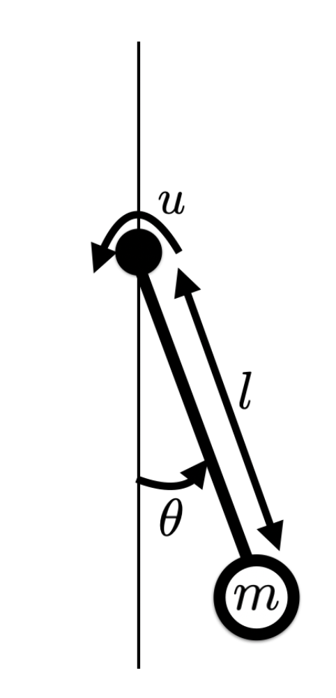

# Inverted Pendulum Q-Learning

This project implements Q-learning to solve the classic inverted pendulum control problem. The goal is to learn a policy that enables a pendulum to perform a swing-up motion from a downward resting position to an inverted upright position, while working within torque constraints. This project was completed as part of the Reinforcement Learning and Optimal Control course at NYU under Professor [Prof. Ludovic Righetti](https://engineering.nyu.edu/faculty/ludovic-righetti).

## Project Overview

The inverted pendulum problem is particularly interesting because:
- The system has limited torque, requiring multiple swing motions to reach the inverted position
- It combines both Q-learning implementation and pendulum dynamics
- It demonstrates practical reinforcement learning on a classical control problem

## Mathematical Framework

The system aims to minimize the discounted cost function:

```math
\sum_{i=0}^{\infty} \alpha^i g(x_i, u_i)
```

where the cost function g(x,u) is:

```math
g(x_i, u_i) = (θ-π)^2 + 0.01 \cdot \dot{θ}_i^2 + 0.0001 \cdot u_i^2
```
<br><br>


### Key Features

- **State Space Discretization**: Implements a 50x50 discretization of the pendulum's state space (θ, ω)
- **Q-Learning Implementation**: 
  - Epsilon-greedy exploration strategy (ε = 0.1)
  - Discounted rewards (α = 0.99)
  - Customizable action space (e.g., u ∈ {-5, 0, 5})
- **Visualization Tools**:
  - Real-time pendulum animation
  - Policy and value function heatmaps
  - State trajectory plotting

## Dependencies

- NumPy
- Matplotlib
- IPython
- Jupyter Notebook

## Usage

1. Clone the repository
2. Install the required dependencies:
   ```bash
   pip install -r requirements.txt
   ```
3. Open and run the Jupyter notebook:
   ```bash
   jupyter notebook Q2.ipynb
   ```

## Project Structure

- `pendulum.py`: Core pendulum dynamics and visualization functions
- `Q2.ipynb`: Main implementation notebook with Q-learning algorithm
- `README.md`: Project documentation

## Results

The implemented Q-learning algorithm successfully:
- Learns an optimal policy for pendulum swing-up
- Demonstrates multiple swing motions to accumulate enough energy
- Achieves stable inverted position maintenance
